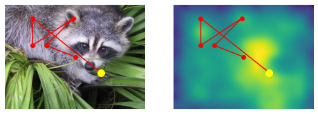

# DeepGaze I, DeepGaze II, DeepGaze IIE, DeepGaze III, and DeepGaze MSDB

This repository contains the pytorch implementations of DeepGaze I, DeepGaze II, DeepGaze IIE, DeepGaze III, and DeepGaze MSDB

Note: Some DeepGaze variants have their own repositories:
- [DeepGaze MR, a video saliency baseline model (ECCV 2020)](https://github.com/mtangemann/deepgazemr)
- [DeepGaze3.5-VL, our newest SOTA scanpath model (ECCV 2026)](https://github.com/Susmit-A/DeepGaze3.5-VL)

## Installation

```bash
pip install .              # DeepGaze I, IIE, III
pip install .[msdb]        # + CLIP, needed for DeepGaze MSDB and DeepGaze III on DeepGaze MSDB
pip install .[training]    # + dependencies of the training / adaptation code
```

The tests run with `python -m pytest tests` (requires the `training` extras and pytest).

## Examples

Below you can see some example uses of the models. For more details, check out [Examples.ipynb]

### DeepGaze MSDB (Spatial Saliency Model)

DeepGaze MSDB (Multi-Scale Dataset Bias) is a saliency model that combines CLIP and DINOv2 features with learned dataset-specific parameters. It processes images at multiple scales and can either use dataset-specific parameters for known datasets or averaged parameters for generalization to new datasets.

```python
import numpy as np
from scipy.misc import face
from scipy.ndimage import zoom
from scipy.special import logsumexp
import torch

import deepgaze_pytorch
from deepgaze_pytorch import MSDBDataset

DEVICE = 'cuda'

model = deepgaze_pytorch.DeepGazeMSDB(pretrained=True).to(DEVICE)

image = face()

# load precomputed centerbias log density (from MIT1003) over a 1024x1024 image
# you can download the centerbias from https://github.com/matthias-k/DeepGaze/releases/download/v1.0.0/centerbias_mit1003.npy
# alternatively, you can use a uniform centerbias via `centerbias_template = np.zeros((1024, 1024))`.
centerbias_template = np.load('centerbias_mit1003.npy')
# rescale to match image size
centerbias = zoom(centerbias_template, (image.shape[0]/centerbias_template.shape[0], image.shape[1]/centerbias_template.shape[1]), order=0, mode='nearest')
# renormalize log density
centerbias -= logsumexp(centerbias)

image_tensor = torch.tensor([image.transpose(2, 0, 1)]).to(DEVICE)
centerbias_tensor = torch.tensor([centerbias]).to(DEVICE)

# For a known dataset (e.g., MIT1003), use dataset-specific parameters:
log_density_prediction = model(image_tensor, centerbias_tensor, pixel_per_dva=35.0, dataset=MSDBDataset.MIT1003)

# For a new/unknown dataset, use averaged parameters for generalization:
log_density_prediction = model(image_tensor, centerbias_tensor, pixel_per_dva=35.0, dataset=None)
```

**Available datasets:** `MSDBDataset.MIT1003`, `MSDBDataset.CAT2000`, `MSDBDataset.COCO_FREEVIEW`, `MSDBDataset.DAEMONS`, `MSDBDataset.FIGRIM`

**Important:** DeepGaze MSDB requires knowing the `pixel_per_dva` (pixels per degree of visual angle) of your display setup. This depends on the viewing distance and screen resolution. For example, MIT1003 was collected at 35 pixels per degree.

#### Adapting DeepGaze MSDB to a new dataset

DeepGaze MSDB can be *adapted* to a new dataset by adding a dataset slot and training its per-dataset parameters (13 scalars) while the CLIP+DINOv2 backbone and the saliency network stay frozen. The new slot is initialised from the average of the model's original datasets, so it starts from the generalization behaviour and only needs a little data to specialise. Adapting does not change the predictions for the built-in datasets, so `dataset=MSDBDataset.MIT1003` (etc.) keeps working afterwards.

You bring your data either directly as pysaliency `stimuli, fixations` objects, or — via the convenience helper — as an image folder plus a CSV of fixations (columns `image`, `x`, `y` in pixels):

```python
from deepgaze_pytorch import DeepGazeMSDB
from deepgaze_pytorch.custom_data import load_fixations_csv, fit_centerbias
from deepgaze_pytorch.msdb_adaptation import adapt_dataset_parameters

# 1. load your data (or bring your own pysaliency stimuli/fixations)
stimuli, fixations = load_fixations_csv('images/', 'fixations.csv')

# 2. fit a center bias over your fixations (or pass your own center-bias model)
centerbias = fit_centerbias(stimuli, fixations)

# 3. adapt: adds a new dataset slot and trains its 13 parameters
#    (train_directory persists checkpoints so an interrupted run can be resumed)
model = DeepGazeMSDB(pretrained=True)
model, new_dataset_index = adapt_dataset_parameters(
    model, stimuli, fixations, centerbias,
    pixel_per_dva=21.75,               # pixels per degree of your presentation
    train_directory='adaptation_run',
)

# 4. use the adapted model on your dataset
log_density = model(image_tensor, centerbias_tensor, pixel_per_dva=21.75, dataset=new_dataset_index)

# optionally save the adapted (head-only) weights
import torch
torch.save(model.head_state_dict(), 'deepgazemsdb_mydataset.pth')
```

`load_fixations_csv` and `fit_centerbias` are convenience helpers — if you already have pysaliency `stimuli, fixations`, or your own center-bias model, pass them straight in. `model.head_state_dict()` is a head-only checkpoint in the same format as the released weights; to reload it, build a `DeepGazeMSDB`, call `model.add_dataset()` (so the parameter shapes match), then `model.load_state_dict(torch.load('deepgazemsdb_mydataset.pth'), strict=False)`.

See [adapt_deepgazemsdb.ipynb](adapt_deepgazemsdb.ipynb) for a full worked example on a public dataset.


### DeepGaze IIE (Spatial Saliency Model)

This is how use the pretained DeepGaze IIE model:

```python
import numpy as np
from scipy.misc import face
from scipy.ndimage import zoom
from scipy.special import logsumexp
import torch

import deepgaze_pytorch

DEVICE = 'cuda'

# you can use DeepGazeI or DeepGazeIIE
model = deepgaze_pytorch.DeepGazeIIE(pretrained=True).to(DEVICE)

image = face()

# load precomputed centerbias log density (from MIT1003) over a 1024x1024 image
# you can download the centerbias from https://github.com/matthias-k/DeepGaze/releases/download/v1.0.0/centerbias_mit1003.npy
# alternatively, you can use a uniform centerbias via `centerbias_template = np.zeros((1024, 1024))`.
centerbias_template = np.load('centerbias_mit1003.npy')
# rescale to match image size
centerbias = zoom(centerbias_template, (image.shape[0]/centerbias_template.shape[0], image.shape[1]/centerbias_template.shape[1]), order=0, mode='nearest')
# renormalize log density
centerbias -= logsumexp(centerbias)

image_tensor = torch.tensor([image.transpose(2, 0, 1)]).to(DEVICE)
centerbias_tensor = torch.tensor([centerbias]).to(DEVICE)

log_density_prediction = model(image_tensor, centerbias_tensor)
```

### DeepGaze III (Scanpath Model)

DeepGaze III is a scanpath model, i.e., the model prediction depends not only on the viewed image, but also on where the observer fixated previously. This is how to use DeepGaze III:

```python
import matplotlib.pyplot as plt
import numpy as np
from scipy.misc import face
from scipy.ndimage import zoom
from scipy.special import logsumexp
import torch

import deepgaze_pytorch

DEVICE = 'cuda'

# you can use DeepGazeI or DeepGazeIIE
model = deepgaze_pytorch.DeepGazeIII(pretrained=True).to(DEVICE)

image = face()

# location of previous scanpath fixations in x and y (pixel coordinates), starting with the initial fixation on the image.
fixation_history_x = np.array([1024//2, 300, 500, 200, 200, 700])
fixation_history_y = np.array([768//2, 300, 100, 300, 100, 500])

# load precomputed centerbias log density (from MIT1003) over a 1024x1024 image
# you can download the centerbias from https://github.com/matthias-k/DeepGaze/releases/download/v1.0.0/centerbias_mit1003.npy
# alternatively, you can use a uniform centerbias via `centerbias_template = np.zeros((1024, 1024))`.
centerbias_template = np.load('centerbias_mit1003.npy')
# rescale to match image size
centerbias = zoom(centerbias_template, (image.shape[0]/centerbias_template.shape[0], image.shape[1]/centerbias_template.shape[1]), order=0, mode='nearest')
# renormalize log density
centerbias -= logsumexp(centerbias)

image_tensor = torch.tensor([image.transpose(2, 0, 1)]).to(DEVICE)
centerbias_tensor = torch.tensor([centerbias]).to(DEVICE)
x_hist_tensor = torch.tensor([fixation_history_x[model.included_fixations]]).to(DEVICE)
y_hist_tensor = torch.tensor([fixation_history_y[model.included_fixations]]).to(DEVICE)

log_density_prediction = model(image_tensor, centerbias_tensor, x_hist_tensor, y_hist_tensor)

f, axs = plt.subplots(nrows=1, ncols=2, figsize=(8, 3))
axs[0].imshow(image)
axs[0].plot(fixation_history_x, fixation_history_y, 'o-', color='red')
axs[0].scatter(fixation_history_x[-1], fixation_history_y[-1], 100, color='yellow', zorder=100)
axs[0].set_axis_off()
axs[1].matshow(log_density_prediction.detach().cpu().numpy()[0, 0])  # first image in batch, first (and only) channel
axs[1].plot(fixation_history_x, fixation_history_y, 'o-', color='red')
axs[1].scatter(fixation_history_x[-1], fixation_history_y[-1], 100, color='yellow', zorder=100)
axs[1].set_axis_off()
```

The figure shows on the left the viewed image with the previous scanpath fixations superimposed and a yellow dot indicating the location of the current fixtion. On the right, the predicted log density for the next fixation location is displayed, again together with the previous scanpath:



### DeepGaze III on DeepGaze MSDB (Scanpath Model)

`DeepGazeIIIMSDB` puts the scanpath part of DeepGaze III on top of the spatial priority map of DeepGaze MSDB. It is an addition of this fork, not one of the published DeepGaze models. It differs from DeepGaze III in three ways:

* the priority map comes from DeepGaze MSDB (CLIP and DINOv2 features at several scales) instead of DeepGaze III's DenseNet-201 readout;
* the previous fixations are encoded in degrees of visual angle, so the model takes `pixel_per_dva` and `dataset` like DeepGaze MSDB;
* the fixation selection is residual and starts at zero, so without training the model reproduces DeepGaze MSDB exactly.

The released scanpath part was trained on MIT1003 with DeepGaze MSDB frozen, on folds 1-8 of the 10-fold split of the released DeepGaze III (fold 9 for validation, fold 0 held out). Continuing the DeepGaze III example above:

```python
from deepgaze_pytorch import MSDBDataset

model = deepgaze_pytorch.DeepGazeIIIMSDB().to(DEVICE)  # DeepGaze MSDB weights + the trained scanpath part

# previous fixations, most recent first (model.included_fixations = [-1, -2, -3, -4]);
# NaN for the missing ones at the beginning of a scanpath
x_hist_tensor = torch.tensor([fixation_history_x[model.included_fixations]], dtype=torch.float32).to(DEVICE)
y_hist_tensor = torch.tensor([fixation_history_y[model.included_fixations]], dtype=torch.float32).to(DEVICE)

# log density of the next fixation, (1, height, width); dataset=None for datasets MSDB was not trained on
log_density_prediction = model(image_tensor, centerbias_tensor, x_hist_tensor, y_hist_tensor,
                               pixel_per_dva=35.0, dataset=MSDBDataset.MIT1003)
```

Results on data that none of the compared models was trained on: information gain in bit per fixation over the center bias, AUC and NSS, all averaged per image. The scores cover all fixations except the first of each scanpath, conditioned on the true previous fixations:

| Model | MIT1003 fold 0: IG | AUC | NSS | OSIE: IG | AUC | NSS |
|---|---|---|---|---|---|---|
| DeepGaze MSDB (no fixation history) | 1.24 | 0.902 | 2.76 | 2.26 | 0.936 | 3.82 |
| DeepGaze III | 1.47 | 0.913 | 3.07 | 2.21 | 0.932 | 3.46 |
| DeepGaze III on DeepGaze MSDB | **1.70** | **0.923** | **3.46** | **2.67** | **0.948** | **4.55** |

On MIT1003 fold 0, the DeepGaze III row is its mixture component that did not see this fold; on OSIE it is the full released model. The gain over DeepGaze III is +0.24 bit per fixation on MIT1003 fold 0 (95% CI over images: 0.20 to 0.27) and +0.46 bit on OSIE (0.45 to 0.48). The evaluation protocol, all comparisons and the scripts to reproduce them are in [experiments/scanpath](experiments/scanpath/README.md).


### Notes about the implementations

* Please note that all DeepGaze models before DeepGaze MSDB have been trained on the MIT1003 dataset which has a resolution of 35 pixels per degree of visual angle and an image size of mostly 1024 pixel in the longer side. Depending how your images have been presented, you might have to downscale or upscale them before passing them to the DeepGaze models.
* The training notebook of DeepGaze III stretches every MIT1003 image to 1024x768 or 768x1024, whatever its aspect ratio. Retrained on the original images with the same recipe, DeepGaze III scores 0.024 bit per fixation higher on held-out, unstretched MIT1003 images (95% CI 0.016 to 0.033) and 0.061 bit higher on OSIE; see [experiments/scanpath](experiments/scanpath/README.md). The scanpath part of DeepGaze III on DeepGaze MSDB is trained on the original images.
* `DeepGaze I`: Please note that the included DeepGaze I model is not exactly the one from the original paper. The original model used caffe for AlexNet and theano for the linear readout
and was trained using the SFO optimizer. Here, we use the torch implementation of AlexNet (without any adaptations) and the DeepGaze II torch implementation with a simple
linear readout network. The model has been retrained with Adam, but still on the same dataset (all images of MIT1003 which are of size 1024x768). Also, we don't use the sparsity
penalty anymore.


### References

If you use these models, please cite the according papers:

* DeepGaze I: [Kümmerer, M., Theis, L., & Bethge, M. (2015). Deep Gaze I: Boosting Saliency Prediction with Feature Maps Trained on ImageNet. ICLR Workshop Track](http://arxiv.org/abs/1411.1045)
* DeepGaze II: [Kümmerer, M., Wallis, T. S. A., Gatys, L. A., & Bethge, M. (2017). Understanding Low- and High-Level Contributions to Fixation Prediction. 4789–4798.](http://openaccess.thecvf.com/content_iccv_2017/html/Kummerer_Understanding_Low-_and_ICCV_2017_paper.html)
* DeepGaze IIE: [Linardos, A., Kümmerer, M., Press, O., & Bethge, M. (2021). Calibrated prediction in and out-of-domain for state-of-the-art saliency modeling. ArXiv:2105.12441 [Cs]](http://arxiv.org/abs/2105.12441)
* DeepGaze III: [M. Kümmerer., M. Bethge, & T.S.A. Wallis, (2022). DeepGaze III: Modeling free-viewing human scanpaths with deep learning. Journal of Vision 2022](https://doi.org/10.1167/jov.22.5.7)
* DeepGaze MSDB: [Kümmerer, M., Khanuja, H., & Bethge, M. (2025). Modeling Saliency Dataset Bias. In Proceedings of the IEEE/CVF International Conference on Computer Vision (ICCV)](https://openaccess.thecvf.com/content/ICCV2025/html/Kummerer_Modeling_Saliency_Dataset_Bias_ICCV_2025_paper.html)
